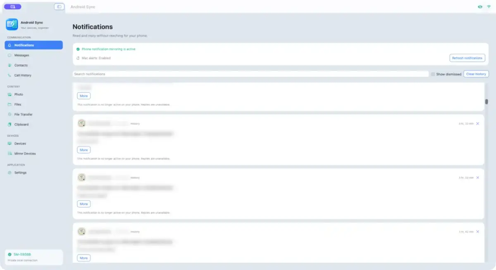
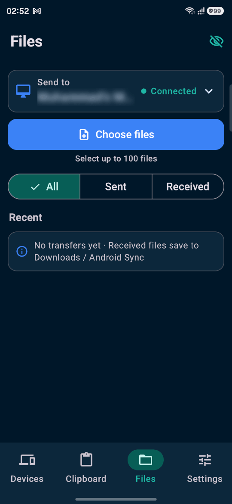

# Android Sync

Native Android and macOS apps for private synchronization over your local network. Created by **Muhammad Sanaullah** · **AndroidSync.com**.

## Screenshots

### macOS



### Android



## Features

- Searchable Android notification inbox on Mac, with replies when supported by the source app.
- Clipboard text, links and images, with searchable encrypted history on Mac.
- Binary file transfers over TLS, with resume support and SHA-256 integrity checks.
- Optional unencrypted local file transfers with a synchronized setting across paired devices.
- Android photo and shared-storage browsing with the required permissions.
- Optional carrier SMS, contacts, call history and call controls. Call audio stays on the phone. MMS and RCS are not supported.
- Screen mirroring with fresh Android capture consent and optional remote control.
- Privacy Mode blurs supported sensitive content. Hover to reveal on Mac. Desktop alerts show the source app and a hidden-content notice while Blur / Stream Mode is enabled.
- Encrypted pairing, separate permissions for each Mac, and no AndroidSync account or cloud relay.

Android limits background clipboard access. Use capture while Android Sync is visible, Android's Share action, or manual capture. Privacy Mode does not hide other apps or the mirrored phone screen; revealed items can appear in recordings.

## File transfer modes

Encrypted Wi-Fi is the default. File bytes stream over authenticated TLS with bounded memory and durable checkpoints approximately every 8 MiB. Interrupted transfers resume from the receiver's saved offset, and received files are published only after SHA-256 verification. Older paired versions can use the original Base64/JSON transfer path.

The optional **Insecure transfer (faster)** checkbox uses an unencrypted local TCP connection for new file batches. File offers and random per-batch tokens still travel over authenticated TLS, and the receiver checks the token and file hash. **Anyone who can observe the local network can read these file bytes.** Hash verification detects corruption; it does not provide privacy.

The setting synchronizes between paired devices and persists across restarts. Turning it off cancels active unencrypted batches; restart them to use TLS. A batch keeps its selected transport rather than changing modes silently. If the plaintext listener is unavailable, disable the option to use encrypted file transfers.

The binary path removes Base64 expansion and per-chunk response waits. Actual throughput depends on Wi-Fi, storage and both devices. Unencrypted mode is not guaranteed to be faster. Large Android gallery selections still need preparation and hashing before transfer.

See [CHANGELOG.md](CHANGELOG.md) for release changes.

## Build Android

Install Android Studio or the Android SDK with platform 37 and a Java runtime compatible with Gradle 9.6 (JDK 17 or newer). Android 12 or newer is required to run the app.

Open `android` in Android Studio to configure the SDK, or set `ANDROID_HOME` to its location. Machine-specific paths belong in an untracked `android/local.properties` file. From the repository root:

```sh
./android/gradlew -p android :app:assembleLocalFullDebug :app:assembleStandardDebug
```

Outputs:

- `android/app/build/outputs/apk/localFull/debug/app-localFull-debug.apk`
- `android/app/build/outputs/apk/standard/debug/app-standard-debug.apk`

The localFull flavor includes optional SMS, shared-storage browsing and remote-control permissions. The standard flavor omits these restricted capabilities. Debug builds use a locally generated debug key; no signing keys are included.

## Build macOS

Install Xcode with the macOS SDK. The app requires macOS 14 or newer. Open `macOS/AndroidSync.xcodeproj`, select **AndroidSync** and your Mac, then build and run. The project includes its source and resources; no project or icon generator is needed.

For a universal Intel and Apple Silicon build, run from the repository root:

```sh
xcodebuild -project macOS/AndroidSync.xcodeproj \
  -scheme AndroidSync -configuration Release \
  -derivedDataPath build/macOS \
  ARCHS="arm64 x86_64" ONLY_ACTIVE_ARCH=NO CODE_SIGNING_ALLOWED=NO build
codesign --force --deep --sign - \
  build/macOS/Build/Products/Release/AndroidSync.app
```

### Direct Swift build alternative

If Xcode's build service stalls, the same source can be compiled and packaged directly. Run these commands from the repository root with the Xcode command line tools selected:

```sh
mkdir -p build/macOS
for arch in arm64 x86_64; do
  swiftc -swift-version 5 -parse-as-library -O \
    -target "$arch-apple-macos14.0" \
    core/Sources/SyncCore/*.swift macOS/AndroidSync/*.swift \
    -o "build/macOS/AndroidSync-$arch"
done
APP=build/macOS/AndroidSync.app
mkdir -p "$APP/Contents/MacOS" "$APP/Contents/Resources/Tools"
lipo -create build/macOS/AndroidSync-arm64 build/macOS/AndroidSync-x86_64 \
  -output "$APP/Contents/MacOS/AndroidSync"
cp macOS/AndroidSync/Info.plist "$APP/Contents/Info.plist"
/usr/libexec/PlistBuddy -c 'Set :CFBundleExecutable AndroidSync' "$APP/Contents/Info.plist"
/usr/libexec/PlistBuddy -c 'Set :CFBundleIdentifier dev.androidsync.mac' "$APP/Contents/Info.plist"
cp macOS/AndroidSync/AndroidSync.icns "$APP/Contents/Resources/"
cp macOS/AndroidSync/Tools/adb macOS/AndroidSync/Tools/NOTICE.txt "$APP/Contents/Resources/Tools/"
codesign --force --deep --sign - --options runtime \
  --entitlements macOS/AndroidSync/AndroidSync.entitlements "$APP"
codesign --verify --deep --strict "$APP"
```

The bundled `macOS/AndroidSync/Tools/adb` is a runtime dependency for optional Advanced Mirroring. Its third-party license notices are included beside it.

### Release signing status

The macOS app in version 1.1.1 is signed with Muhammad Sanaullah's Apple Developer ID Application identity and notarized by Apple. Its stapled notarization ticket has been validated. Download official packages from the [v1.1.1 release](https://github.com/sanishan/android-sync/releases/tag/v1.1.1).

The Full APK is signed with the permanent AndroidSync release key. The `dev.androidsync` package and signing certificate were recorded as registered and verified through Google's Android developer verification on 26 September 2026. Google does not sign this APK or certify its contents. The Standard package has separate registration requirements and is not included in this signed release workflow.

For additional control, we recommend reviewing the source and compiling your own APK or Mac app. Building from source is not a guarantee of safety; protect your build tools and dependencies. Personal builds use your own signing identity and may not update an existing installation signed with another key.

### Build a signed Android release

The manual **Build Android** GitHub Actions workflow tests, assembles, signs and verifies the Full APK. It requires the repository secrets `ANDROID_SYNC_RELEASE_KEYSTORE_BASE64` and `ANDROID_SYNC_RELEASE_PASSWORD`, and produces the `AndroidSync-signed-build` artifact without publishing a release. Never add these values or a keystore to Git.

For a local release build, use your own existing signing key:

```sh
./android/gradlew -p android :app:testLocalFullDebugUnitTest :app:assembleLocalFullRelease
"$ANDROID_HOME/build-tools/36.0.0/zipalign" -p -f 4 \
  android/app/build/outputs/apk/localFull/release/app-localFull-release-unsigned.apk \
  /tmp/AndroidSync-aligned.apk
# Set ANDROID_SIGNING_PASSWORD securely in your environment; do not put it in shell history.
"$ANDROID_HOME/build-tools/36.0.0/apksigner" sign \
  --ks /secure/path/release.p12 --ks-key-alias YOUR_KEY_ALIAS \
  --ks-pass env:ANDROID_SIGNING_PASSWORD --key-pass env:ANDROID_SIGNING_PASSWORD \
  --out /tmp/AndroidSync-1.1.1.apk /tmp/AndroidSync-aligned.apk
"$ANDROID_HOME/build-tools/36.0.0/apksigner" verify --verbose --print-certs /tmp/AndroidSync-1.1.1.apk
```

Keep the same release key for future updates. Older debug-signed installations cannot be updated in place by this release key. Save anything important before uninstalling an older build; reinstalling requires pairing and setup again.

### Build, sign and notarize the Mac DMG

1. Install Xcode and its command line tools. Enroll in the Apple Developer Program and add your account in Xcode Settings. Create a **Developer ID Application** certificate with its private key in Keychain. Keep private keys, passwords and API keys outside the repository. The project uses the official developer's team; choose your own team for a personal build.
2. Set the release version and build number in `macOS/AndroidSync/Info.plist`. For this release they are `1.1.1` and `10`. Open `macOS/AndroidSync.xcodeproj`, select the AndroidSync scheme, use Release configuration and keep Hardened Runtime enabled. Build both `arm64` and `x86_64` with `ONLY_ACTIVE_ARCH=NO`.
3. Choose **Product → Archive**. In **Window → Organizer → Archives**, select the archive and choose **Distribute App → Developer ID / Direct Distribution**. Let Xcode sign and submit it to Apple. Wait until Apple reports acceptance, then export the notarized app. Do not edit files inside the exported bundle.
4. Verify the exported app and its nested executable. Use the actual ADB location in your bundle, which can be `Contents/Resources/adb` or `Contents/Resources/Tools/adb`:

```sh
APP="/path/to/export/AndroidSync.app"
codesign --verify --deep --strict "$APP"
codesign -dv --verbose=4 "$APP" 2>&1
codesign --verify --strict "$APP/Contents/Resources/adb"
lipo -archs "$APP/Contents/MacOS/AndroidSync"
xcrun stapler validate "$APP"
```

Confirm Developer ID Application, your team, hardened runtime, a secure timestamp, both architectures and a valid stapled ticket. The entitlements must not include `get-task-allow`. If nested ADB is not distribution-signed, fix its signing before the app is signed and resubmit the corrected build.

5. Create a DMG containing the accepted app and an Applications shortcut, then sign the DMG:

```sh
mkdir -p build/dmg-stage
 ditto "$APP" build/dmg-stage/AndroidSync.app
ln -s /Applications build/dmg-stage/Applications
hdiutil create -volname AndroidSync -srcfolder build/dmg-stage \
  -ov -format UDZO build/AndroidSync-macOS-1.1.1.dmg
codesign --sign "Developer ID Application: YOUR NAME (TEAMID)" \
  --timestamp build/AndroidSync-macOS-1.1.1.dmg
```

6. Set up a `notarytool` Keychain profile using Apple's interactive `xcrun notarytool store-credentials` flow. Keep its secrets in Keychain. Submit the final DMG, using your profile name:

```sh
xcrun notarytool submit build/AndroidSync-macOS-1.1.1.dmg \
  --keychain-profile YOUR_PROFILE --wait
```

Apple processing can take time. If you stop waiting, retain the submission ID and check it with `xcrun notarytool info SUBMISSION_ID --keychain-profile YOUR_PROFILE`. If rejected, inspect the notarization log and fix the cause. Do not publish until status is **Accepted**.

7. Staple and validate the DMG, then test the exact final download with Gatekeeper enabled:

```sh
xcrun stapler staple build/AndroidSync-macOS-1.1.1.dmg
xcrun stapler validate build/AndroidSync-macOS-1.1.1.dmg
codesign --verify --strict build/AndroidSync-macOS-1.1.1.dmg
spctl --assess --type open --context context:primary-signature \
  --verbose=2 build/AndroidSync-macOS-1.1.1.dmg
shasum -a 256 build/AndroidSync-macOS-1.1.1.dmg
```

Test installation, pairing and relaunch in a clean Mac user account, preferably on another Mac. Older ad hoc builds may require Keychain access approval when migrating. Notarization does not grant access to existing Keychain items. Package the stapled app separately if offering a ZIP. A ZIP itself cannot be stapled, and a new outer DMG needs its own notarization.

References: [Apple notarization](https://developer.apple.com/documentation/security/notarizing-macos-software-before-distribution), [Apple packaging](https://developer.apple.com/documentation/xcode/packaging-mac-software-for-distribution), [Android developer verification](https://developer.android.com/developer-verification/guides/google-play-console).

## Install and pair

1. Install your chosen APK on Android. If prompted, allow the file app to install that package.
2. Move `AndroidSync.app` to Applications and open it. Official releases must pass the signing and notarization checks above. For personal local builds blocked by macOS, review [Apple's instructions](https://support.apple.com/en-us/102445). If you trust the source, the app-specific exception is in **System Settings → Privacy & Security → Open Anyway** after a blocked launch. Do not override a malware warning.
3. Connect both devices to the same private network. Allow Local Network access on Mac.
4. In Mac **Devices**, create an invitation. On Android, scan its QR code or use invitation text. Pair each Mac separately.
5. Enable Android notification access and Android Sync notification permission for mirroring. Allow Mac notifications for native alerts.
6. Enable clipboard sharing and grant optional file, SMS, contacts or remote-control permissions only for the features you use. Review Android battery restrictions if background connectivity stops.

Received files go to **Downloads / Android Sync** by default. You can choose a receive folder on Mac. If pairing fails, check the firewall and Wi-Fi client isolation, or use the local address shown in the invitation.

For public spaces and recording, enable **Settings → Privacy → Blur Sensitive Information (Stream Mode)** on Mac. Enable Stream Mode separately on Android. Keep the pointer away from sensitive items while recording.

## License

[Android Sync Personal Source License 1.0](LICENSE) permits personal, noncommercial use and private modification. Commercial use and redistribution require prior written permission. Preserve the **Android Sync** name, **AndroidSync.com** attribution, and **Muhammad Sanaullah** copyright notice. Signing or modifying a copy does not transfer ownership.

This is source-available software, not OSI-approved open source. Third-party components retain their own licenses. Installation instructions are in this README; the LICENSE defines usage rights.
